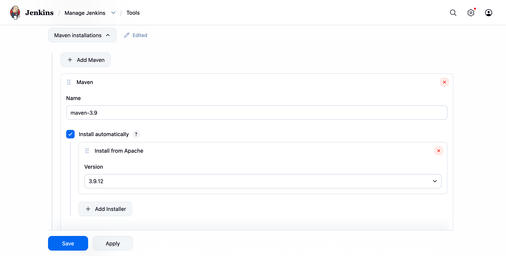
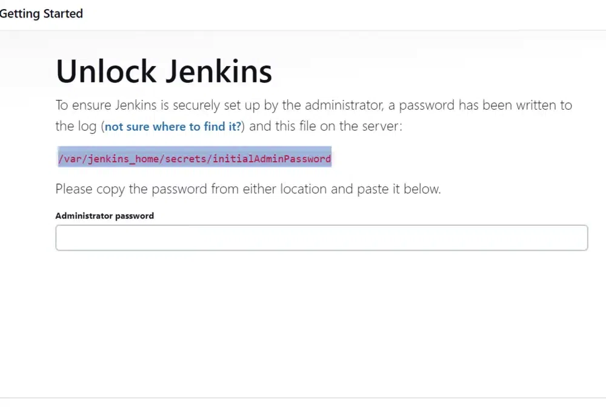
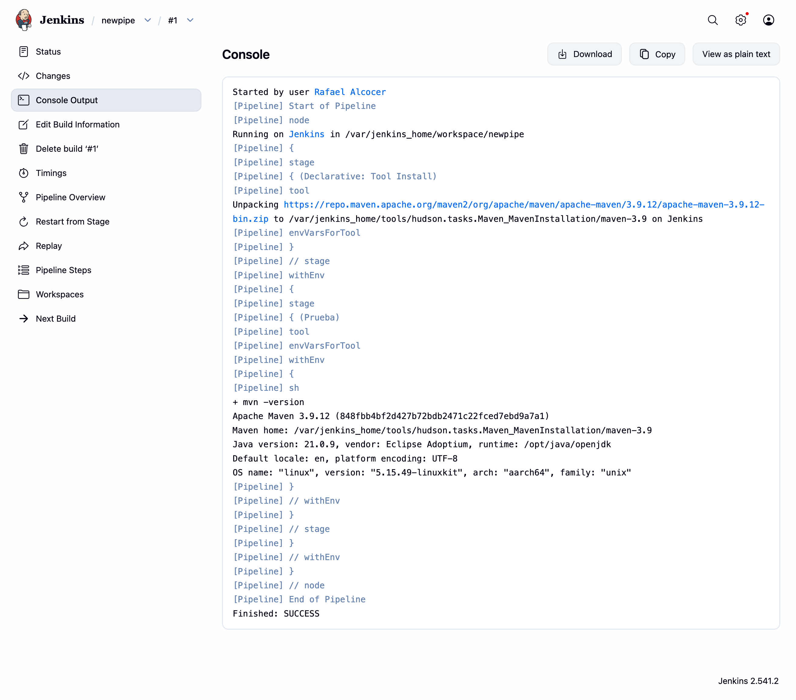
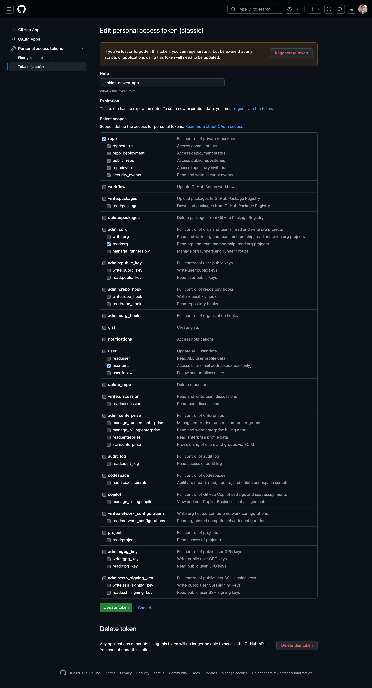
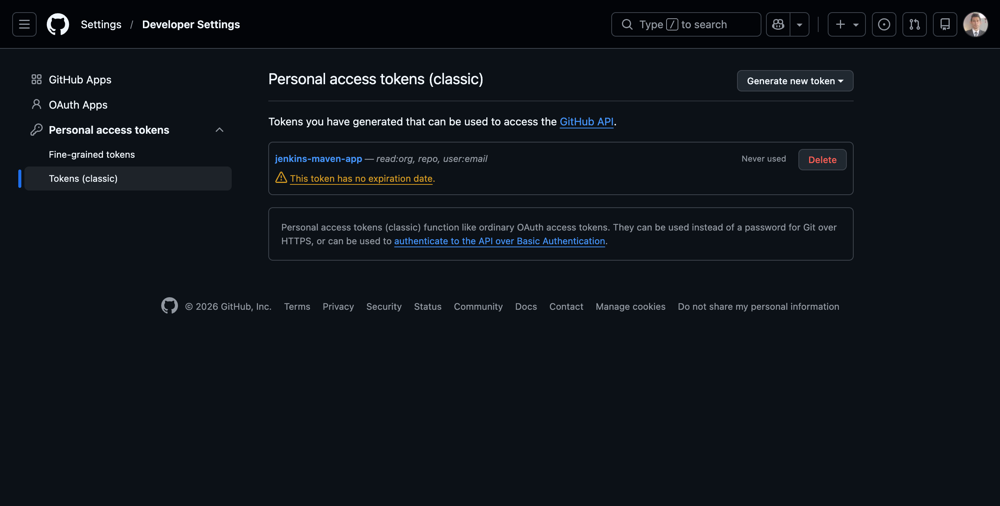
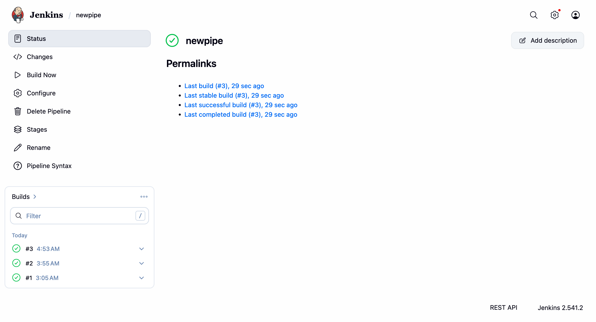

# Simplest Java Maven App running on Docker.

To run Jenkins with Maven in the simplest way, it's ideal to use the official Jenkins image and configure Maven from its interface, or use a small Dockerfile if you want it pre-installed.

## docker-compose.yml
Here is the recommended minimum configuration using Docker Compose:

```yml
version: '3.8'
services:
  jenkins:
    image: jenkins/jenkins:lts
    privileged: true
    user: root
    ports:
      - "8080:8080"
      - "50000:50000"
    volumes:
      - jenkins_home:/var/jenkins_home
      - /var/run/docker.sock:/var/run/docker.sock
    restart: always

volumes:
  jenkins_home:
```

## Run docker compose up


```log
rac@MacBook-Pro-de-Rafael RAC % docker compose up
[+] Running 3/3
 ⠿ Network rac_default        Created                                      0.1s
 ⠿ Volume "rac_jenkins_home"  Created                                      0.0s
 ⠿ Container rac-jenkins-1    Created                                      0.2s
Attaching to rac-jenkins-1
rac-jenkins-1  | Running from: /usr/share/jenkins/jenkins.war
rac-jenkins-1  | webroot: /var/jenkins_home/war
rac-jenkins-1  | 2026-02-28 03:00:13.812+0000 [id=1]	INFO	winstone.Logger#logInternal: Beginning extraction from war file
rac-jenkins-1  | 2026-02-28 03:00:16.199+0000 [id=1]	WARNING	o.e.j.ee9.nested.ContextHandler#setContextPath: Empty contextPath
rac-jenkins-1  | 2026-02-28 03:00:16.239+0000 [id=1]	INFO	org.eclipse.jetty.server.Server#doStart: jetty-12.1.5; built: 2025-12-03T22:18:24.732Z; git: 4905d09d7b6801e792d7b73946cf7b66e4be25d6; jvm 21.0.9+10-LTS
rac-jenkins-1  | 2026-02-28 03:00:16.539+0000 [id=1]	INFO	o.e.j.e.w.StandardDescriptorProcessor#visitServlet: NO JSP Support for /, did not find org.eclipse.jetty.ee9.jsp.JettyJspServlet
rac-jenkins-1  | 2026-02-28 03:00:16.621+0000 [id=1]	INFO	o.e.j.s.DefaultSessionIdManager#doStart: Session workerName=node0
rac-jenkins-1  | 2026-02-28 03:00:16.882+0000 [id=1]	INFO	hudson.WebAppMain#contextInitialized: Jenkins home directory: /var/jenkins_home found at: EnvVars.masterEnvVars.get("JENKINS_HOME")
rac-jenkins-1  | 2026-02-28 03:00:16.994+0000 [id=1]	INFO	o.e.j.s.handler.ContextHandler#doStart: Started oeje9n.ContextHandler$CoreContextHandler@3681037{Jenkins v2.541.2,/,b=file:///var/jenkins_home/war/,a=AVAILABLE,h=oeje9n.ContextHandler$CoreContextHandler$CoreToNestedHandler@2459319c{STARTED}}
rac-jenkins-1  | 2026-02-28 03:00:17.002+0000 [id=1]	INFO	o.e.j.server.AbstractConnector#doStart: Started oejs.ServerConnector@2aa6311a{HTTP/1.1, (http/1.1)}{0.0.0.0:8080}
rac-jenkins-1  | 2026-02-28 03:00:17.002+0000 [id=1]	INFO	org.eclipse.jetty.server.Server#doStart: Started oejs.Server@53a665ad{STARTING}[12.1.5,sto=0] @764ms
rac-jenkins-1  | 2026-02-28 03:00:17.003+0000 [id=35]	INFO	winstone.Logger#logInternal: Winstone Servlet Engine running: controlPort=disabled
rac-jenkins-1  | 2026-02-28 03:00:17.105+0000 [id=34]	INFO	jenkins.model.Jenkins#<init>: Starting version 2.541.2
rac-jenkins-1  | 2026-02-28 03:00:17.163+0000 [id=43]	INFO	jenkins.InitReactorRunner$1#onAttained: Started initialization
rac-jenkins-1  | 2026-02-28 03:00:17.179+0000 [id=50]	INFO	jenkins.InitReactorRunner$1#onAttained: Listed all plugins
rac-jenkins-1  | 2026-02-28 03:00:17.640+0000 [id=48]	INFO	jenkins.InitReactorRunner$1#onAttained: Prepared all plugins
rac-jenkins-1  | 2026-02-28 03:00:17.643+0000 [id=48]	INFO	jenkins.InitReactorRunner$1#onAttained: Started all plugins
rac-jenkins-1  | 2026-02-28 03:00:17.643+0000 [id=49]	INFO	jenkins.InitReactorRunner$1#onAttained: Augmented all extensions
rac-jenkins-1  | 2026-02-28 03:00:17.731+0000 [id=43]	INFO	jenkins.InitReactorRunner$1#onAttained: System config loaded
rac-jenkins-1  | 2026-02-28 03:00:17.731+0000 [id=43]	INFO	jenkins.InitReactorRunner$1#onAttained: System config adapted
rac-jenkins-1  | 2026-02-28 03:00:17.732+0000 [id=43]	INFO	jenkins.InitReactorRunner$1#onAttained: Loaded all jobs
rac-jenkins-1  | 2026-02-28 03:00:17.733+0000 [id=43]	INFO	jenkins.InitReactorRunner$1#onAttained: Configuration for all jobs updated
rac-jenkins-1  | 2026-02-28 03:00:17.749+0000 [id=64]	INFO	hudson.util.Retrier#start: Attempt #1 to do the action check updates server
rac-jenkins-1  | 2026-02-28 03:00:18.018+0000 [id=42]	INFO	jenkins.install.SetupWizard#init: 
rac-jenkins-1  | [LF]> 
rac-jenkins-1  | [LF]> *************************************************************
rac-jenkins-1  | [LF]> *************************************************************
rac-jenkins-1  | [LF]> *************************************************************
rac-jenkins-1  | [LF]> 
rac-jenkins-1  | [LF]> Jenkins initial setup is required. An admin user has been created and a password generated.
rac-jenkins-1  | [LF]> Please use the following password to proceed to installation:
rac-jenkins-1  | [LF]> 
rac-jenkins-1  | [LF]> 85e8bffcdb294a2c8cd024f40eb0b8e0
rac-jenkins-1  | [LF]> 
rac-jenkins-1  | [LF]> This may also be found at: /var/jenkins_home/secrets/initialAdminPassword
rac-jenkins-1  | [LF]> 
rac-jenkins-1  | [LF]> *************************************************************
rac-jenkins-1  | [LF]> *************************************************************
rac-jenkins-1  | [LF]> *************************************************************
rac-jenkins-1  | 
rac-jenkins-1  | 2026-02-28 03:00:20.830+0000 [id=45]	INFO	jenkins.InitReactorRunner$1#onAttained: Completed initialization
rac-jenkins-1  | 2026-02-28 03:00:20.845+0000 [id=34]	INFO	hudson.lifecycle.Lifecycle#onReady: Jenkins is fully up and running
```

## Access Jenkins UI
Open your browser and go to http://localhost:8080. 
You will see the Jenkins setup page. 
Use the password provided in the terminal (e.g. 85e8bffcdb294a2c8cd024f40eb0b8e0) to unlock Jenkins and follow the setup wizard to install the recommended plugins and create your first admin user.



## How force Jenkins to show UI always in English?
Install the Locale plugin. You can set the default language for all users, no matter the language configured in their browser.

[Jenkins Locale](https://plugins.jenkins.io/locale/)

## How to have Maven available
Go to Manage Jenkins > Tools > Maven installations. <br/>
Click "Add Maven", give it a name (e.g. maven-3.9) and check the Install automatically box. <br/>
Jenkins will download it on its own when you need it in a Pipeline.



To connect Jenkins to a real GitHub project and build it with Maven, follow these structured steps:

1. Prepare Jenkins credentials
   If your repository is private, or to avoid GitHub limits, you need to set up a Personal Access Token (PAT):
   In Jenkins, go to Manage Jenkins > Credentials > System > Global credentials Jenkins.io.
   Click on Add Credentials.
   Kind: Select Username with password Medium.
   Username: Your GitHub username.
   Password: Paste your GitHub Personal Access Token.
   ID: Give it something like github-creds.
   

   

2. Create the Pipeline in Jenkins
   Click on New Item, give it a name (e.g. mi-proyecto-maven) and choose Pipeline Contabo.
   In the Pipeline section, change the definition to Pipeline script from SCM Jenkins.io.
   Select Git and enter your GitHub repository URL (e.g. https://github.com).
   In Credentials, select the ones you created (github-creds) Medium.
   Make sure the branch is correct (usually */main or */master).

3. The Jenkinsfile (In your repository)
   For Jenkins to know what to do, create a file called Jenkinsfile in the root of your GitHub repository with this content:

```jenkins
pipeline {
    agent any
    tools {
        // Usa el nombre que configuraste en "Global Tool Configuration"
        maven 'maven-3.9' 
    }
    stages {
        stage('Checkout') {
            steps {
                // Jenkins descarga el código automáticamente desde SCM
                checkout scm
            }
        }
        stage('Build & Test') {
            steps {
                // Comando estándar de Maven para compilar y probar
                sh 'mvn clean install'
            }
        }
    }
}
```



